<h1 align="center">
  JoeBlakeB's Advent of Code Solutions
</h1>

<!-- AOC TILES BEGIN -->
<h1 align="center">
  2023 - 26 ⭐
</h1>
<a href="2023/01-Trebuchet.py">
  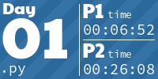
</a>
<a href="2023/02-Cube-Conundrum.py">
  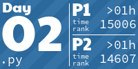
</a>
<a href="2023/03-Gear-Ratios.py">
  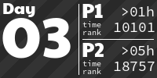
</a>
<a href="2023/04-Scratchcards.cpp">
  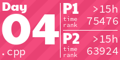
</a>
<a href="2023/05-If-You-Give-A-Seed-A-Fertilizer.cpp">
  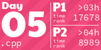
</a>
<a href="2023/06-Wait-For-It.py">
  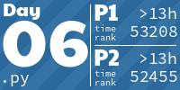
</a>
<a href="2023/07-Camel-Cards.py">
  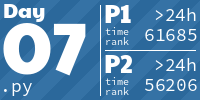
</a>
<a href="2023/08-Haunted-Wasteland.py">
  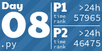
</a>
<a href="2023/09-Mirage-Maintenance.py">
  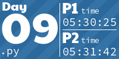
</a>
<a href="2023/10-Pipe-Maze.py">
  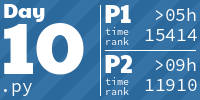
</a>
<a href="2023/11-Cosmic-Expansion.py">
  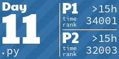
</a>

<h1 align="center">
  2022 - 50 ⭐
</h1>
<a href="2022/01-Calorie-Counting.py">
  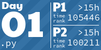
</a>
<a href="2022/02-Rock-Paper-Scissors.py">
  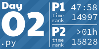
</a>
<a href="2022/03-Rucksack-Reorganization.py">
  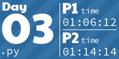
</a>
<a href="2022/04-Camp-Cleanup.py">
  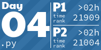
</a>
<a href="2022/05-Supply-Stacks.py">
  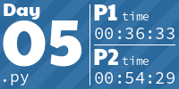
</a>

<a href="2022/07-No-Space-Left-On-Device.py">
  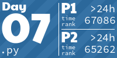
</a>
<a href="2022/08-Treetop-Tree-House.py">
  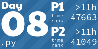
</a>
<a href="2022/09-Rope-Bridge.py">
  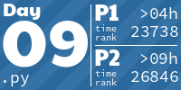
</a>
<a href="2022/10-Cathode-Ray-Tube.py">
  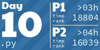
</a>
<a href="2022/11-Monkey-in-the-Middle.py">
  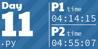
</a>
<a href="2022/12-Hill-Climbing-Algorithm.py">
  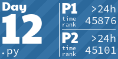
</a>
<a href="2022/13-Distress-Signal.py">
  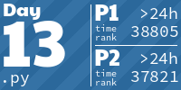
</a>
<a href="2022/14-Regolith-Reservoir.py">
  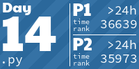
</a>
<a href="2022/15-Beacon-Exclusion-Zone.py">
  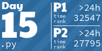
</a>
<a href="2022/16-Proboscidea-Volcanium.py">
  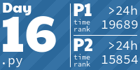
</a>
<a href="2022/17-Pyroclastic-Flow.py">
  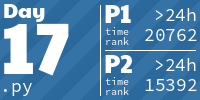
</a>
<a href="2022/18-Boiling-Boulders.py">
  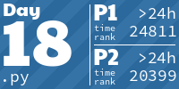
</a>
<a href="2022/19-Not-Enough-Minerals.py">
  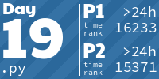
</a>
<a href="2022/20-Grove-Positioning-System.py">
  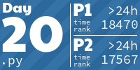
</a>
<a href="2022/21-Monkey-Maths.py">
  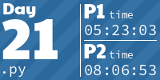
</a>
<a href="2022/22-Monkey-Map.py">
  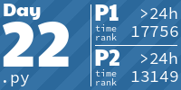
</a>
<a href="2022/23-Unstable-Diffusion.py">
  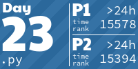
</a>
<a href="2022/24-Blizzard-Basin.py">
  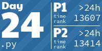
</a>
<a href="2022/25-Full-of-Hot-Air.py">
  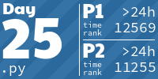
</a>
<h1 align="center">
  2015 - 42 ⭐
</h1>
<a href="2015/01-Not-Quite-Lisp.cpp">
  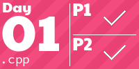
</a>
<a href="2015/02-I-Was-Told-There-Would-Be-No-Maths.cpp">
  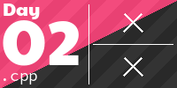
</a>
<a href="2015/03-Perfectly-Spherical-Houses-in-a-Vacuum.cpp">
  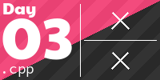
</a>

<a href="2015/05-Doesnt-He-Have-Intern-Elves-For-This.cpp">
  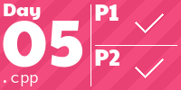
</a>
<a href="2015/06-Probably-a-Fire-Hazard.cpp">
  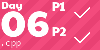
</a>
<a href="2015/07-Some-Assembly-Required.cpp">
  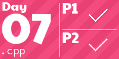
</a>
<a href="2015/08-Matchsticks.cpp">
  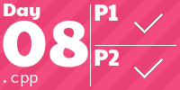
</a>
<a href="2015/09-All-in-a-Single-Night.cpp">
  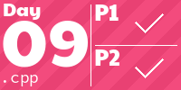
</a>
<a href="2015/10-Elves-Look-Elves-Say.cpp">
  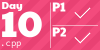
</a>
<a href="2015/11-Corporate-Policy.cpp">
  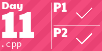
</a>
<a href="2015/12-JSAbacusFramework.cpp">
  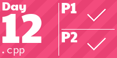
</a>
<a href="2015/13-Knights-of-the-Dinner-Table.cpp">
  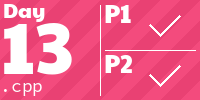
</a>
<a href="2015/14-Reindeer-Olympics.cpp">
  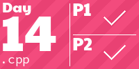
</a>
<a href="2015/15-Science-for-Hungry-People.cpp">
  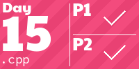
</a>
<a href="2015/16-aunt-sue.cpp">
  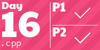
</a>

<!-- AOC TILES END -->
