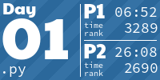
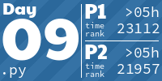
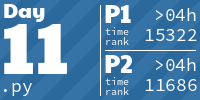
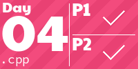

<h1 align="center">
  JoeBlakeB's Advent of Code Solutions
</h1>

<!-- AOC TILES BEGIN -->
<h1 align="center">
  2023 - 26 ⭐
</h1>

<h1 align="center">
  2022 - 50 ⭐
</h1>

<h1 align="center">
  2015 - 42 ⭐
</h1>

<!-- AOC TILES END -->
